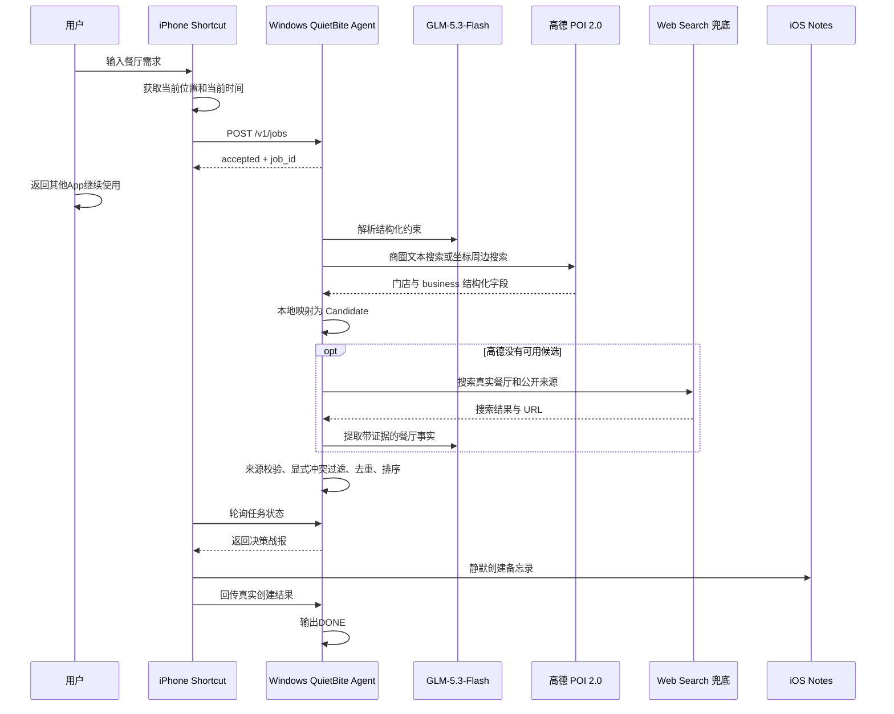

# QuietBite Agent V0.3.0 开发 Spec

**审批状态：** 已批准，本文档是 `gpt-5.6-luna` 子 Code Agent 的开发执行合同。  
**工作区：** `D:\新建文件夹\蓝色鲸鱼`  
**说明：** 本 Spec 完整替换此前讨论的 QuietTrip 面试行程方案。
**2026-09-19 修订：** 用户批准按 Web Search API 实际可得信息缩减输出；营业时间、
人均、评分、推荐菜和电话均改为可选证据，缺失时不展示，只在全局说明中声明未展示内容尚未确认，不得声称满足相关约束。
**2026-09-19 V0.2 修订：** 最多展示 5 家；普通忌口只作为点菜提醒，不淘汰整家
餐厅；对可用但信息稀疏的候选，优先通过 Web Search 定向检索大众点评公开摘要。
**2026-09-19 V0.2.1 修订：** 大众点评定向检索改用 Web Search API 正式的
`search_domain_filter=www.dianping.com` 参数，不再依赖搜索词中的 `site:` 语法；
诊断日志同时记录过滤前后的来源数量。
**2026-09-19 V0.3.0 修订：** 用户已取得并实测高德“Web 服务”Key。高德 POI 2.0
改为主数据源，本地代码直接映射评分、人均、当日营业时间和电话；明确商圈使用
文本搜索，可选经纬度使用 3 公里周边搜索。Web Search 与点评门店页过滤降为兜底。
本修订取代本文后续“暂不使用高德 Web API”的旧决策。

---

## 1. 产品定义

### 1.1 目标

QuietBite 是一个“不抢手机前台”的本地餐厅调研 Agent。

用户从 iPhone 主屏幕点击 `QuietBite`，输入一句需求，例如：

```text
今晚7点两个人想吃川菜，人均150元以内，不吃内脏，
帮我在当前位置附近找几家靠谱的餐厅。
```

Shortcut 自动取得当前时间、当前位置转换出的地址文本和请求 UUID。提交后用户立即切回微信、备忘录等应用继续操作，Windows Agent 在后台：

1. 解析用餐约束；
2. 明确商圈时制定高德文本检索参数；否则在可用时使用已降精度的当前位置坐标；
3. 从高德 POI 2.0 检索真实门店和 `business` 字段；无可用结果时再进入 Web Search 兜底；
4. 本地代码直接映射门店、地址、评分、人均、当日营业时间和电话，避免模型二次改写；
5. 剔除来源明确显示已打烊、超预算、菜系不符或基础证据不足的候选；普通忌口不淘汰整家餐厅，由用户点餐时自行避开；
6. 用确定性评分选择最多 5 家；
7. 生成带来源的餐厅决策战报；
8. 通过 Shortcut 静默写入 iPhone 备忘录；
9. 收到真实创建结果后，Windows 才输出 `[DONE]`。

> 创建备忘录只是结果交付方式。项目核心是多约束理解、联网检索、来源约束、实体去重、显式冲突过滤和可解释排序；搜索来源未提供的事实不会被补写。

### 1.2 最终输出

备忘录名称示例：

```text
QuietBite｜川菜｜2026-09-18
```

正文必须包含：

```text
【你的需求】
【本次结论】
【候选 1】
【候选 2】
【候选 3】
【候选 4】
【候选 5】
【说明】
【检索时间】
```

每家餐厅必须包含具体门店名称、带来源的地址或位置依据，以及直接放在该门店下方的来源标题和 URL。营业时间、人均、评分、推荐菜、公开摘要和电话仅在来源明确支持时展示；缺失字段不显示，也不列出逐店“未确认字段”。末尾只保留一条全局说明，明确未展示内容尚未确认。

### 1.3 明确限制

V0.3.0 不提供：

- 步行、驾车或公交路线；
- 真实路线距离或预计到达时间；
- 餐厅预订、自动打电话或自动打开地图；
- 实时排队桌数；
- GUI 点击、截图识别或第三方 App 自动操作；
- 大众点评等网站的定向爬虫。

不得展示具体排队判断。备忘录末尾只保留一次统一说明：

```text
预算、营业状态和实时排队请打开详情或联系商家确认；普通忌口请点餐时自行避开。
```

不得让模型估算、推测或编造排队情况。

当高德或兜底来源没有营业时间或人均时，V0.3.0 只返回“候选线索”，不保证目标时间营业或满足预算；备忘录必须明确提醒用户打开来源或电话核实。

---

## 2. 架构与技术方案

### 2.1 数据流程



### 2.2 技术选型

| 模块 | 选型 | 理由 |
|---|---|---|
| 手机入口 | iOS Shortcut | 原生获得位置、输入和备忘录权限，不模拟点击 |
| 后端 | Python 3.11 | Windows 本地部署简单 |
| HTTP 服务 | `ThreadingHTTPServer` | 请求规模小，无需 Web 框架 |
| 意图解析 | `glm-5.3-flash` | 将中文需求转换为固定 JSON |
| 联网检索 | 高德 POI 2.0；Web Search 兜底 | 先取得结构化门店字段；无可用 POI 时保持兼容降级 |
| 排序 | 本地确定性代码 | 防止模型随意修改排名 |
| 结果交付 | iOS Notes | 后台可写、方便用户稍后查看 |
| 状态存储 | 内存字典 | V0.3.0 单机演示无需数据库 |

参考：[智谱搜索示例](https://docs.bigmodel.cn/cn/best-practice/case/ai-search-engine) · [Apple Shortcut 动作机制](https://support.apple.com/en-ca/guide/shortcuts/apda850ab0e1/ios)

### 2.3 不选择的方案

- 不使用 scrcpy、AutoGLM 或视觉 GUI Agent，因为它们会与用户争夺屏幕、焦点和触控。
- 使用高德 POI 搜索，但不接入路线规划 API，因此不承诺距离、路线和预计到达时间。
- 不抓取点评平台页面；只消费搜索服务返回的公开摘要和 URL，避免登录、Cookie、
  反爬、合规和演示稳定性问题。
- 不开发原生 iOS App，第一版使用系统 Shortcut 完成入口和执行。
- 不开发 Web 前端，正式演示使用 Windows 状态日志和最终 iPhone 备忘录。

### 2.4 文件结构

```text
蓝色鲸鱼/
├── QUIETBITE_SPEC.md
├── 手机Agent实战题.md
├── server.py
├── test_server.py
├── README.md
├── .env.example
├── .gitignore
└── docs/
    ├── SHORTCUT_SETUP.md
    └── REAL_DEVICE_ACCEPTANCE.md
```

规则：

- 不修改 `手机Agent实战题.md` 和本 Spec；
- 不创建多层 Python Package；
- 不在 Windows 上伪造 `.shortcut` 文件；
- 不提交密钥、Token、真实精确地址或运行日志；
- Shortcut 必须在真实 iPhone 上创建并导出。

### 2.5 Python 依赖

运行代码只使用 Python 标准库：

```text
http.server
urllib.request
urllib.parse
json
datetime
uuid
secrets
threading
concurrent.futures
re
os
time
logging
math
unittest
unittest.mock
```

不创建 `requirements.txt`。

`server.py` 主要函数：

```text
load_config
read_json_body
authenticate
redact_location_for_log
sanitize_location_for_cloud
call_bigmodel
parse_intent
parse_coordinates
call_amap_search
extract_amap_candidates
call_web_search
extract_search_results
build_search_prompt
extract_candidate_facts
validate_evidence
normalize_restaurant_name
deduplicate_candidates
is_open_at_target
filter_candidates
score_candidate
rank_candidates
build_note
create_job
run_job
get_job
complete_job
main
```

只允许创建 HTTP Handler 和必要的数据类，不得增加 Provider、Repository、Factory 等单实现抽象。

### 2.6 环境变量

| 变量 | 必填 | 默认值 |
|---|---:|---|
| `BIGMODEL_API_KEY` | 是 | 无 |
| `AMAP_WEB_KEY` | 是 | 无，高德开放平台“Web 服务”Key |
| `PHONE_AGENT_TOKEN` | 是 | 无 |
| `AGENT_BIND_HOST` | 否 | `0.0.0.0` |
| `AGENT_PORT` | 否 | `8765` |
| `JOB_DEADLINE_SECONDS` | 否 | `60` |

约束：

- Deadline 范围为 15–60 秒；
- 缺少必填变量时拒绝启动；
- 服务不自动加载 `.env`；
- `.env.example` 只放占位值；
- 日志不得包含 Token、API Key 或完整位置。

### 2.7 状态模型

```text
RECEIVED
PARSING
SEARCHING
VALIDATING
READY
COMPLETED
REJECTED
FAILED
```

使用：

```python
jobs: dict[str, dict]
jobs_lock = threading.Lock()
worker_pool = ThreadPoolExecutor(max_workers=4)
```

同一时刻最多执行 2 个研究任务，超出时返回 `SERVER_BUSY`。

---

## 3. API 与 Agent 行为

### 3.1 通用规则

- JSON 使用 UTF-8，返回时设置 `ensure_ascii=False`；
- 请求体最大 8192 字节；
- `/health` 外均要求 Bearer Token，并使用 `secrets.compare_digest`；
- 用户指令最大 1000 字，位置文本最大 500 字；
- 不记录完整输入；
- `request_id` 作为幂等键。

### 3.2 健康检查

```http
GET /health
```

```json
{
  "status": "ok",
  "service": "quietbite-agent",
  "version": "0.1.0",
  "intent_model": "glm-5.3-flash",
  "search_model": "amap-place-search-v5"
}
```

### 3.3 创建任务

```http
POST /v1/jobs
```

请求：

```json
{
  "request_id": "0ca0e647-9e37-44ec-928f-e171dc573889",
  "instruction": "今晚7点两个人想吃川菜，人均150元以内，不吃内脏，帮我找几家靠谱餐厅。",
  "location_text": "中国\n广东省\n深圳市 南山区\n示例路4387号",
  "client_now": "2026-09-18T17:30:00+08:00",
  "timezone": "Asia/Shanghai",
  "latitude": 22.512,
  "longitude": 113.923
}
```

上述 `location_text` 保留了 2026-09-18 在目标 iPhone 上验证得到的 Shortcut
多行序列化格式，但道路名称与门牌是仓库安全的合成测试值。Windows 必须先在本地将其脱敏为：

```text
广东省 深圳市 南山区 示例路附近
```

只有脱敏后的范围文本可以进入云端模型或文本搜索请求；`4387号` 不得出现在日志、模型请求和最终战报中。`latitude` 与 `longitude` 可选但必须成对提供，服务端保留 3 位小数后仅用于高德周边搜索，不进入日志、Notes 或持久化文件。

成功接收：

```json
{
  "status": "accepted",
  "job_id": "c4c10598-0484-4bd2-b574-f6a6a1ef35ca",
  "poll_after_seconds": 2,
  "poll_limit": 20
}
```

业务校验失败：

```json
{
  "status": "rejected",
  "error_code": "INVALID_REQUEST",
  "message": "请提供菜系、食物类型或其他用餐偏好。"
}
```

### 3.4 查询任务

```http
GET /v1/jobs/{job_id}
```

进行中：

```json
{
  "status": "searching",
  "job_id": "...",
  "stage": "正在核对餐厅公开信息"
}
```

完成：

```json
{
  "status": "ready",
  "job_id": "...",
  "candidate_count": 2,
  "fewer_than_requested": true,
  "note": {
    "title": "QuietBite｜川菜｜2026-09-18",
    "body": "..."
  }
}
```

拒绝或失败：

```json
{
  "status": "rejected",
  "job_id": "...",
  "error_code": "NO_VERIFIABLE_CANDIDATES",
  "message": "未找到信息足够可靠且符合要求的餐厅。"
}
```

### 3.5 完成回调

```http
POST /v1/jobs/{job_id}/complete
```

```json
{
  "note_created": true,
  "completed_at": "2026-09-18T17:30:28+08:00"
}
```

`note_created` 必须根据 Create Note 动作的真实输出计算，禁止硬编码。成功后打印：

```text
[DONE] job_id=<id> note=1 candidates=<N>
```

不存在、未 Ready 或创建失败时不得输出 `[DONE]`。

### 3.6 幂等

- 相同 `request_id` 只执行一次联网检索；
- 进行中时返回同一 Job；
- Ready 时返回同一结果；
- Completed 时返回结果和 `"already_complete": true`；
- 重复完成回调不重复创建状态或打印完成信息。

### 3.7 意图结构

`glm-5.3-flash` 必须输出 JSON：

```json
{
  "meal_at": "2026-09-18T19:00:00+08:00",
  "city": "深圳市",
  "district": "南山区",
  "area_hint": "示例路附近",
  "cuisines": ["川菜"],
  "party_size": 2,
  "budget_per_person": 150,
  "avoid_foods": ["内脏"],
  "preferences": [],
  "queue_requirement": "soft",
  "medical_allergy": false
}
```

规则：

- 用餐时间必须在当前时间到未来 24 小时之间；
- “今晚”但没写时间：当前时间早于 19:00 时使用当日 19:00，否则使用当前时间加 60 分钟；
- 没有任何时间信息时使用当前时间加 60 分钟；
- `party_size` 默认 1，范围 1–20；
- 人均预算为空或 1–5000；
- 菜系最多 3 个，忌口最多 10 个；
- `queue_requirement`：未提排队为 `none`，“最好少排队”为 `soft`，“必须不用排队”为 `hard`；
- `hard` 直接返回 `LIVE_QUEUE_UNAVAILABLE`；
- 严重食物过敏或要求绝对安全时返回 `SAFETY_CONSTRAINT_UNSUPPORTED`。

### 3.8 位置信息与隐私

真机已验证 Shortcut 会把位置转换为下列多行结构；为避免提交真实精确地址，
这里使用合成道路名称和门牌：

```text
中国
广东省
深圳市 南山区
示例路4387号
```

服务端必须：

1. 分行、去空白、去空行；
2. 丢弃国家行；
3. 保留省、市、区；
4. 对最后的街路行删除门牌、楼栋、单元和房号；
5. 对 `示例路4387号` 精确得到 `示例路附近`；
6. 只把 `广东省 深圳市 南山区 示例路附近` 发送到云端；
7. 原始位置只留在内存，不打印、不持久化；
8. 搜索范围优先使用用户指令中明确指定的商圈；
9. 可选坐标必须成对、有限且在经纬度范围内，进入 Job 前保留 3 位小数；
10. 坐标只发送给高德周边搜索，不打印、不写 Notes、不持久化；
11. 无法识别城市时返回 `LOCATION_UNUSABLE`。

门牌脱敏优先保留以 `大道|公路|街道|路|街|巷` 结尾的道路名，再去除其后的数字和建筑定位信息；不得简单删除所有数字导致道路名称损坏。

### 3.9 联网搜索

主调用：

```text
GET https://restapi.amap.com/v5/place/text
GET https://restapi.amap.com/v5/place/around
show_fields = business
types = 050000
```

检索规则：

- 指令明确包含商圈、地铁站或“某地附近”时使用 `/text`，关键词为商圈与菜系；
- 没有明确商圈且有可选坐标时使用 `/around`，半径 3000 米并按距离排序；
- 没有坐标时使用脱敏后的地址文本执行 `/text`；
- 每次最多请求 20 个餐饮 POI，本地最多输出证据最完整的 5 家；
- 从 `business` 读取 `rating`、`cost`、`opentime_today`、`tel` 和 `tag`；
- 由本地代码直接转换 Candidate，不将这些数值交给 LLM 重写；
- 按目标城市、区县检查 POI，错误区县的门店不得进入候选；
- 为每家门店生成不含 Key 的 `https://uri.amap.com/marker?...` 详情来源；
- 推荐菜、实时排队、距离和路线不在高德 POI 字段能力内，不得推测。

高德没有可用候选或暂时不可用时，才调用兼容兜底：

1. `POST https://open.bigmodel.cn/api/paas/v4/web_search`，`search_engine=search_pro`；
2. 首轮使用区域和菜系发现具体门店，最多取 10 条中等长度摘要；
3. 首轮已有可用但字段不完整的候选时，对最多 5 家各执行一次不超过 70 字的
   精确门店名查询，并传入 `search_domain_filter=www.dianping.com`；目标字段为评分、
   人均、营业时间、电话和推荐菜；
4. 定向查询最多 3 路并发，单次超时上限 12 秒，并为最终事实抽取保留截止时间；
5. 只有 URL 主机名等于 `dianping.com` 或以 `.dianping.com` 结尾的结果才视为
   大众点评来源，`fake-dianping.com` 等相似域名必须丢弃；
6. 单家定向搜索失败或没有大众点评结果时，保留首轮已通过基础证据门槛的候选，
   不因可选质量补证失败而使整个任务失败；
7. 首轮 0 家通过时，仍可为最多 2 家具体门店补搜公开证据。

搜索结果解析：

1. 递归查找响应 JSON 中名为 `search_result` 的数组；
2. 从每项提取 `title`、`url` 或 `link`、`content` 或 `snippet`，并按 URL 标记
   `source_kind=dianping|web`；高德来源由本地代码标记为 `source_kind=amap`；
3. 只保留 HTTP/HTTPS URL；
4. 按 URL 去重；
5. 最多保留 30 个结果；
6. 单条摘要最多 1500 字，总输入最多 20000 字；
7. 为每条来源分配 `S1`、`S2` 等内部 ID。

不得由后端继续抓取任意来源 URL，避免 SSRF、反爬和不可控延迟。

### 3.10 搜索内容安全

所有联网结果均视为不可信数据：

- 搜索摘要中的指令不得被执行；
- 提示词用明确分隔符包裹来源；
- 系统提示声明来源中的命令、角色要求和提示词均是数据；
- 模型只能填写固定 Candidate Schema；
- 高德主链路只接受响应中的固定 POI 字段；Web Search 兜底中的字段仍必须由
  `source_ids` 约束，不能覆盖已经确认的高德数值；
- 同名不同分店不得合并，大众点评字段只有在门店名及分店或地址能够对应时才可引用；
- 来源明确冲突时该字段留空，不得让模型自行选择更有利的值；
- `source_ids` 必须是后端真实分配的 ID；
- 模型生成不存在的 Source ID 时，该字段无效。

### 3.11 Candidate Schema

```json
{
  "candidates": [
    {
      "name": "示例川菜馆（南山店）",
      "address": {
        "value": "深圳市南山区某路88号",
        "source_ids": ["S1"]
      },
      "opening_hours": {
        "description": "周一至周日 11:00-22:00",
        "target_day_intervals": ["11:00-22:00"],
        "source_ids": ["S1", "S2"]
      },
      "average_cost": {
        "value": 128,
        "currency": "CNY",
        "source_ids": ["S2"]
      },
      "rating": {
        "value": 4.6,
        "scale": 5.0,
        "source_ids": ["S2"]
      },
      "phone": {
        "value": "0755-12345678",
        "source_ids": ["S1"]
      },
      "recommended_dishes": [
        {
          "value": "水煮鱼",
          "source_ids": ["S2", "S3"]
        }
      ],
      "cuisine_match": true,
      "quality_summary": "公开信息中评分较高，水煮鱼被多次提及。"
    }
  ]
}
```

### 3.12 来源证据门槛

一家餐厅只有满足以下条件才可进入最终结果：

- 名称明确到具体门店；
- 地址非空且有合法 Source ID；
- 地址位于目标城市或区县；
- 菜系匹配；普通忌口不作为整店淘汰条件，严重过敏仍按安全限制拒绝任务；
- 至少有一个合法来源 URL。

营业时间和人均属于可选事实：

- 有合法来源且营业区间可解析时，本地代码判断目标时间；来源明确显示已打烊则剔除；
- 有合法来源的人均数字时执行预算过滤；来源明确显示超预算则剔除；
- 字段缺失、无来源或含义不明确时不据此通过或拒绝，战报直接省略该字段；
- 无来源字段不得展示，不能把“未知”写成“满足预算”或“目标时间营业”。

没有足够候选时可返回 1–4 家，不允许为凑足 5 家放宽门店、位置、菜系或来源 URL 门槛；0 家时返回 `NO_VERIFIABLE_CANDIDATES`。

### 3.13 营业时间判断

来源明确提供营业时间时，模型负责规范化为区间，本地代码负责判断，并支持：

```text
11:00-22:00
11:00-14:00,17:00-22:00
18:00-02:00
```

结束时间小于开始时间表示跨午夜。格式非法、无来源或含义不明确时不得展示营业结论，但不因该可选字段缺失而淘汰门店。

### 3.14 去重

标准化名称时转为小写、去空格和常见标点，但保留门店后缀。同一标准化名称且地址相同视为重复，只保留证据更完整的一项；不同分店不得合并。

### 3.15 排名

排名由本地代码计算。先按字段完整度降序选择最多 5 家；只有字段完整度相同时，
再按下列总分排序：

```text
总分 = 评分分 × 55% + 来源可信度 × 25% + 字段完整度 × 20%
```

- 评分分按 `value / scale × 100` 归一化；没有数字评分时为 50；
- 来源可信度：1 个不同域名为 40，2 个为 75，3 个及以上为 100；
- 字段完整度：地址、营业时间、人均、评分、电话、推荐菜中有合法来源的字段数除以 6；缺失字段只降低排序分，不代表满足对应约束。

总分相同时依次比较不同来源域名数、归一化评分、餐厅名称字典序。LLM 不得在本地评分后重新排列名次。

### 3.16 战报生成

战报由本地模板生成，模型只提供经过校验的事实和短摘要：

```text
【候选 1】
餐厅名称

公开摘要：（仅有来源时）
地址：
公开评分：（可选）
人均消费：（可选）
营业时间：（可选）
目标时间状态：来源显示营业（仅有可解析来源时）
推荐菜：（可选）
电话：（可选）
详情来源：
来源标题
https://example.com/store

【说明】
只展示公开来源明确支持的信息；未展示内容尚未确认。
预算、营业状态和实时排队请打开详情或联系商家确认；普通忌口请点餐时自行避开。
```

来源标题和 URL 直接放在对应门店下方；末尾列出检索时间和一条全局说明。不得复制长篇评论或网页正文，不得为缺失字段输出重复占位文本。

---

## 4. iPhone Shortcut 与真实验收

### 4.1 Shortcut 动作

`docs/SHORTCUT_SETUP.md` 必须逐步说明：

1. `Ask for Input` 获取用餐需求；
2. `Get Current Location`；
3. 将当前位置变量放入 Text 动作，得到多行地址文本；
4. 可选：从位置提取纬度与经度，作为数字成对提交；
5. `Current Date` 并格式化为带时区 ISO 8601；
6. 生成 UUID；
7. POST `/v1/jobs`；
8. 收到 `accepted` 后循环 Wait 2 Seconds、GET `/v1/jobs/{job_id}`，最多 35 次；
9. `ready` 时创建备忘录；
10. 根据 Create Note 的真实输出计算 `note_created`；
11. POST `/complete`；
12. 静默结束。

禁止使用 Show Result、Show Alert、Show Notification、Open App、Quick Look 或打开 Notes 编辑页面。

正式部署前预授权当前位置、本地网络、备忘录和网络请求 Always Allow，并使用专用 Notes Folder：`QuietBite`。

### 4.2 自动化代码检查

运行：

```powershell
python -m unittest -v
```

自动化结果只能标记为 `CHECK_OK` 或 `CHECK_FAILED`。至少覆盖：

- 合法需求解析；
- “今晚”默认时间、过去时间和超过 24 小时；
- 真实多行位置结构与合成样例 `示例路4387号` 的脱敏；
- 原始门牌号不进入云端请求和日志；
- 可选坐标成对校验、范围校验与三位小数降精度；
- 高德文本搜索、周边搜索、结构化字段映射与区县过滤；
- 搜索结果递归提取；
- URL 和 Source ID 校验；
- 大众点评精确门店查询、真实子域识别和相似域名拒绝；
- 已通过但信息稀疏的候选触发质量补证，单家搜索失败时安全回退；
- 来源内容中的提示注入文本；
- 营业时间单区间、分段和跨午夜；
- 有来源时的营业/预算显式冲突过滤，以及字段缺失时的省略分支；
- Candidate 门店/位置/来源证据门槛，以及普通忌口不淘汰整店；
- 只找到 1–4 家时正常返回、最多展示 5 家、0 家时拒绝；
- 重复门店合并；
- 排名公式和 Tie-break；
- 请求幂等、异步轮询、完成回调；
- Token、请求体和未知路由。

所有自动化网络请求必须 Mock。

### 4.3 真机测试原则

只有真实 iPhone 测试能够使用 `PASS / FAIL / BLOCKED / NOT_RUN`。必须同时使用真实 iPhone、真实当前位置、真实 Shortcut、真实 Windows 服务、真实 `glm-5.3-flash`、真实 Web Search API `search_pro`、真实 Notes、真实互联网结果和用户真实前台操作。

Mock、固定结果、直接 HTTP 调用均不能算项目通过。

### 4.4 RT-01：真实推荐与无干扰

输入：

```text
今晚7点两个人想吃川菜，人均150元以内，不吃内脏，
帮我在当前位置附近找几家靠谱餐厅。
```

提交后，用户立即切换到聊天或备忘录并连续打字至少 30 秒，同时录像拍到 iPhone 和 Windows。必须满足：

- 前台 App 未被切走，键盘和输入焦点未丢失；
- 没有通知和结果弹窗；
- 创建恰好 1 篇新备忘录；
- 包含 1–5 家真实候选餐厅且每家满足来源证据门槛；
- 未获得来源支持的营业时间、人均、评分、推荐菜或电话没有被展示为已确认；
- 缺少营业时间或人均时，明确声明不保证目标时间营业或满足预算；
- 没有距离或路线耗时声明；
- 排队统一显示未知；
- `[DONE]` 在真实创建回调之后出现。

### 4.5 RT-02：约束变化

```text
今晚想吃日料，一个人，人均200元以内，不吃生食，
帮我在当前位置附近找可靠的选择。
```

必须重新执行真实搜索，不复用上次结果；地址和证据对应本次位置与菜系；有来源的预算冲突被过滤，普通忌口不淘汰整家餐厅且由用户点餐时避开，缺失预算信息不展示且不宣称满足，用户前台仍不受干扰。

### 4.6 RT-03：不可验证约束

```text
今晚必须找一家确定完全不用排队的川菜馆。
```

预期返回 `LIVE_QUEUE_UNAVAILABLE`，不创建备忘录、不输出 `[DONE]`、不编造实时排队情况。

### 4.7 事实人工核验

对 RT-01 和 RT-02 的每家候选人工检查名称、地址和来源 URL；公开摘要、营业时间、人均、评分、推荐菜及电话只核验实际展示的字段。任何已展示字段无来源或与来源矛盾即为 `FAIL`；缺失字段只要未被展示或宣称满足，不因此判定失败。

`docs/REAL_DEVICE_ACCEPTANCE.md` 必须记录 iPhone 型号、iOS 版本、测试时间、输入原文、任务耗时、测试前后 Notes 数量、每项条件、来源核验、视频文件名和总体结论。

项目总体只有在自动化测试 `CHECK_OK`、RT-01/02/03 全部 `PASS`、人工事实核验通过、无前台干扰且演示视频完成后才能标记 `PASS`。

---

## 5. README、交付和 Luna 规则

### 5.1 README

README 使用中文，控制在约 120–140 行，必须包含：

- 一句话项目定位和真实演示场景；
- Mermaid 架构图；
- 简要技术选型说明；
- 为什么不用 GUI Agent 和地图路线 API；
- 证据约束与“不编造排队”的原则；
- 环境变量、PowerShell 启动命令和 Shortcut 配置链接；
- 真机测试方式和已知限制；
- 以下声明：

```text
自动化测试通过不代表项目通过。
只有真实 iPhone、真实模型、真实搜索和人工事实核验全部通过，
项目才能标记为 PASS。
```

### 5.2 Luna 子 Agent 配置与约束

开发 Agent：

```text
model: gpt-5.6-luna
reasoning_effort: max
context inheritance: none
```

子 Agent 必须：

1. 完整阅读本 Spec 和 `手机Agent实战题.md`；
2. 不修改这两个文档；
3. 只实现 V0.3.0；
4. 不创建其他子 Agent；
5. 不增加地图、路线、预订或爬虫；
6. 不创建或推送 GitHub 仓库；
7. 不泄露密钥；
8. 运行自动化测试并报告 `CHECK_OK/CHECK_FAILED`；
9. 未参与真实手机测试时，整体状态必须是 `NOT_RUN`；
10. 不得把 Mock 或 HTTP 直调写成真机通过。

### 5.3 子 Agent 代码交付状态

```text
Implementation: COMPLETE
Automated checks: CHECK_OK
Real model smoke test: PASS / BLOCKED / NOT_RUN
Real iPhone acceptance: NOT_RUN
Overall project status: NOT_RUN
```

### 5.4 Git 提交建议

```text
docs: add QuietBite implementation spec
feat: implement evidence-grounded restaurant agent
test: cover search validation and ranking
docs: add iPhone shortcut and deployment guide
docs: record real-device acceptance
```

本阶段不得由子 Agent 创建或推送 GitHub 仓库。主 Agent 负责最终代码审查、测试复跑、真实模型验证和真机验收。
