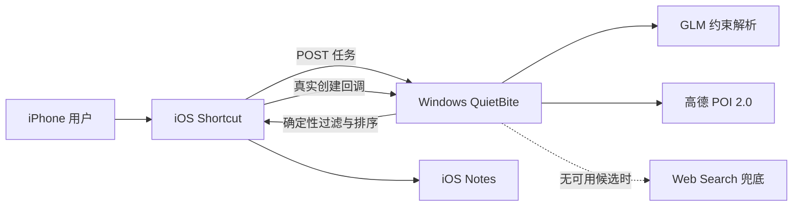

# QuietBite Agent

QuietBite 是一个“不抢手机前台”的餐厅调研 Agent：iPhone Shortcut 提交需求后，
用户可继续聊天或打字；Windows 后台完成检索与校验，最后静默写入一篇带来源的 Notes。

**演示场景：** 用户持续操作 iPhone 至少 30 秒，同时 Agent 根据位置、菜系、预算和时间
筛选最多 5 家餐厅；只有 Notes 真实创建后，Windows 才输出 `[DONE]`。

## 架构



Shortcut 使用系统原生位置、网络和 Notes 能力，不控制 GUI，也不争抢屏幕、焦点或键盘。

## 技术选型

| 模块 | 方案 |
|---|---|
| 手机入口与交付 | iOS Shortcut + Notes |
| 后端 | Python 3.11 标准库 `ThreadingHTTPServer`，无第三方运行依赖 |
| 约束理解 | `glm-5.3-flash` |
| 餐厅数据 | 高德 POI 2.0；Web Search 仅作兜底 |
| 决策 | 本地代码做区域、预算、营业冲突、去重和排序 |

## 环境变量

| 变量 | 必填 | 默认值/说明 |
|---|---:|---|
| `BIGMODEL_API_KEY` | 是 | 智谱 API Key |
| `AMAP_WEB_KEY` | 是 | 高德“Web 服务”Key |
| `PHONE_AGENT_TOKEN` | 是 | 必须与 Shortcut Bearer Token 完全一致 |
| `AGENT_BIND_HOST` | 否 | `0.0.0.0` |
| `AGENT_PORT` | 否 | `8765` |
| `JOB_DEADLINE_SECONDS` | 否 | `60`，范围 15–60 |

## 部署

1. 在 Windows 安装 Python 3.11，取得代码；项目不需要 `pip install`。
2. 在同一个 PowerShell 窗口配置并启动：

```powershell
gh repo clone Nioo4/quietbite-agent
Set-Location .\quietbite-agent
$env:BIGMODEL_API_KEY = "你的智谱Key"
$env:AMAP_WEB_KEY = "你的高德Web服务Key"
$env:PHONE_AGENT_TOKEN = "与Shortcut相同的长随机Token"
$env:AGENT_BIND_HOST = "0.0.0.0"
$env:AGENT_PORT = "8765"
$env:JOB_DEADLINE_SECONDS = "60"
python server.py
```

3. 让 iPhone 与 Windows 位于同一可信局域网，并允许 Windows 专用网络入站 TCP `8765`。
4. 在 iPhone Shortcut 中设置服务地址 `http://<Windows-IP>:8765` 和请求头
   `Authorization: Bearer <PHONE_AGENT_TOKEN>`，预授权位置、本地网络、Notes 和网络请求。
5. 用 iPhone Safari 打开 `http://<Windows-IP>:8765/health`；返回 `status=ok` 后运行 Shortcut。

Shortcut 动作配置见 [docs/SHORTCUT_SETUP.md](docs/SHORTCUT_SETUP.md)。

## 验收与限制

```powershell
python -m unittest -v
```

当前自动化为 `37/37 CHECK_OK`；真机功能验收已由用户确认 `PASS`。完整证据与剩余交付项见
[docs/REAL_DEVICE_ACCEPTANCE.md](docs/REAL_DEVICE_ACCEPTANCE.md)。自动化不能替代真实 iPhone、
真实模型、真实 POI、Notes 创建和人工来源核验。

V0.3.0 不提供路线、距离、预订、自动电话或实时排队；任务状态只存内存。密钥、真实
Token、精确位置和本机 Demo `.shortcut` 不得提交仓库。
