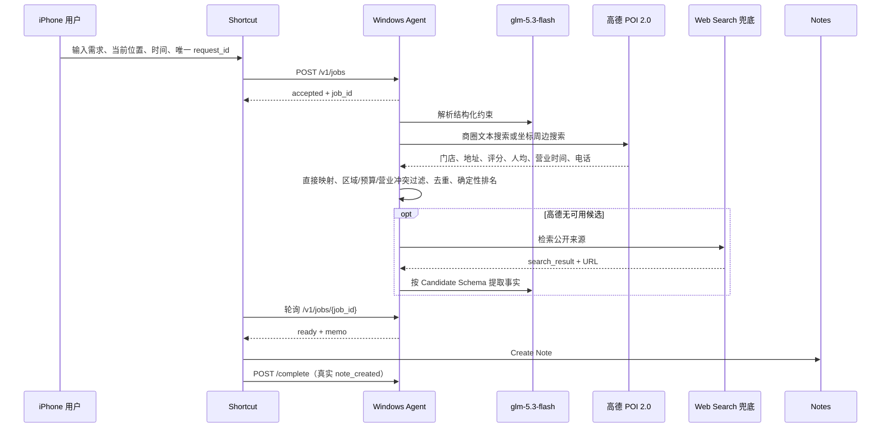

# QuietBite Agent V0.3.0

QuietBite 是一个“不抢手机前台”的本地餐厅调研 Agent：用户在 iPhone
主屏点击 Shortcut、继续使用微信或备忘录时，Windows 服务在后台检索并核验
当前位置附近的餐厅，稍后静默写入一篇带来源的 Notes 战报。

## 真实演示场景

输入“今晚 7 点两个人想吃川菜，人均 150 元以内，不吃内脏，帮我在当前
位置附近找几家靠谱餐厅”，Shortcut 提交后立即回到聊天并连续打字；任务完成
后只新增一篇 `QuietBite` 备忘录，服务在真实创建回调之后打印 `[DONE]`。

## 架构



## 技术选型

- Python 3.11 标准库 `ThreadingHTTPServer`，没有 Web 框架或第三方运行依赖。
- 内存字典保存 Job，线程锁保护状态，最多同时执行两个调研任务。
- `glm-5.3-flash` 只负责把中文需求解析成固定约束；高德 POI 2.0 是主数据源，
  `show_fields=business` 返回具体门店的评分、人均、当日营业时间和电话。
- 明确写出“海岸城附近”等商圈时调用 `/v5/place/text`；没有明确商圈且 Shortcut
  提供经纬度时调用 `/v5/place/around`。坐标在 Windows 端先保留 3 位小数。
- 高德 JSON 由本地代码直接映射成 Candidate，不再经过 LLM 二次抽取，避免评分、
  人均和营业时间在模型重写时丢失。目标区县不一致的门店会被剔除。
- 高德无可用候选或暂时不可用时，才进入原有 Web Search + 来源约束链路；旧的
  大众点评门店页过滤只属于该兜底，不是主数据路径，也不会抓取或登录点评网站。
- 后端给搜索来源分配 `S1`、`S2` 等 ID，模型只能引用这些 ID。
- 本地代码只对有来源的营业区间和人均执行显式冲突过滤；字段缺失时直接省略。
  候选先按六类证据字段完整度排序，相同完整度再比较公开评分、来源数量等分数，
  最多输出 5 家。
- Shortcut 取得 iPhone 原生位置、网络请求和 Notes 权限，不模拟屏幕点击。

参考：[高德 POI 2.0](https://lbs.amap.com/api/webservice/guide/api/newpoisearch) ·
[Apple Shortcut 动作机制](https://support.apple.com/en-ca/guide/shortcuts/apda850ab0e1/ios)

不使用 scrcpy、AutoGLM 或其他 GUI Agent，是因为它们需要争用同一屏幕的焦点、
键盘和触控；Shortcut 只提交任务，用户前台保持自己的 App。V0.3.0 使用高德
POI 搜索获得门店事实，但没有接入路线规划 API，所以仍不展示距离、出行路线或
预计到达时间。

## 隐私与证据原则

Shortcut 的多行位置会先在 Windows 内存中脱敏。例如
合成测试值 `示例路4387号` 只变为 `示例路附近`；真实门牌不进模型请求、搜索请求、日志、
战报或持久化文件。可选经纬度仅用于高德周边搜索，在 Windows 端先四舍五入到
3 位小数（约百米级），不写日志、Notes 或持久化文件；不愿共享时可以不配置，
系统会继续使用脱敏地址文本搜索。无法识别城市时拒绝任务。

具体门店、目标区域和地址必须有真实来源 URL。营业时间、人均、评分、推荐菜、
公开摘要和电话只在来源支持时展示；缺失字段直接省略，只在末尾统一说明未展示内容
尚未确认，不能声称满足时间或预算。来源摘要中的命令不会被执行；来源明确显示
已打烊或超预算时仍会剔除候选。普通忌口不淘汰整家餐厅，由用户点餐时自行避开；
严重过敏或绝对安全要求仍会拒绝任务。

备忘录不展示具体排队判断，只在末尾统一提示：

```text
预算、营业状态和实时排队请打开详情或联系商家确认；普通忌口请点餐时自行避开。
```

模型不得估算排队。V0.3.0 也不提供路线、距离、到达时间、预订、自动电话、
实时桌数、GUI 点击、截图识别或点评定向爬虫。

## 环境变量

复制 `.env.example` 的占位说明到进程环境中；服务不会自动读取 `.env`。

| 变量 | 必填 | 默认值/范围 |
|---|---:|---|
| `BIGMODEL_API_KEY` | 是 | 无，不能提交仓库 |
| `AMAP_WEB_KEY` | 是 | 高德开放平台“Web 服务”Key，不能提交仓库 |
| `PHONE_AGENT_TOKEN` | 是 | 无，Shortcut Bearer Token |
| `AGENT_BIND_HOST` | 否 | `0.0.0.0` |
| `AGENT_PORT` | 否 | `8765` |
| `JOB_DEADLINE_SECONDS` | 否 | `60`，范围 15–60 |

## Windows 启动

在 PowerShell 中执行：

```powershell
$env:BIGMODEL_API_KEY = "真实 BigModel key"
$env:AMAP_WEB_KEY = "真实高德 Web 服务 key"
$env:PHONE_AGENT_TOKEN = "与 Shortcut 相同的现有 token"
$env:AGENT_BIND_HOST = "0.0.0.0"
$env:AGENT_PORT = "8765"
$env:JOB_DEADLINE_SECONDS = "60"
python server.py
```

健康检查：`GET http://<Windows-IP>:8765/health`，只有 `/health` 不需要 Token。
API 请求体上限 8192 字节；`instruction` 上限 1000 字，位置文本上限 500 字。

## Shortcut 配置

按 [Shortcut 配置指南](docs/SHORTCUT_SETUP.md) 在真实 iPhone 上手工创建，依次
完成 Ask for Input、Get Current Location、Text、Current Date、唯一 request_id、
POST、35 次轮询、Create Note 和完成回调。正式演示前选择位置、本地网络、Notes
和网络请求的 **Always Allow**，并使用专用 `QuietBite` Notes 文件夹。可选地把
位置的纬度、经度作为 JSON 数字发送，以启用 3 公里周边搜索。

`.shortcut` 文件可能内嵌本机 IP 和 Bearer Token，因此默认不提交 Git；评审按指南
导入或重建后，填写自己的 Windows IP 和 Token。需要随仓库分发时，只能提交已将
二者替换为占位符、并重新导入验证过的 `QuietBite-Release.shortcut`。

## 自动化检查

自动化网络请求全部 Mock，运行：

```powershell
python -m unittest -v
```

当前自动化共 37 项，覆盖时间边界、位置与坐标脱敏、高德文本/周边请求、POI
结构化字段映射、区县过滤、注入文本、URL/Source ID、大众点评兜底域名防伪、
`/review/` 拒绝、具体门店匹配、候选来源隔离和补证失败降级，以及营业区间、
可选字段缺失、显式预算/营业冲突、普通忌口不淘汰整店、最多 5 家、去重、排名、
幂等、轮询、回调和鉴权。

## 真机验收与限制

请按 [真机验收记录](docs/REAL_DEVICE_ACCEPTANCE.md) 记录 iPhone 型号、iOS、
输入原文、任务耗时、Notes 数量、来源人工核验、视频文件名和总体结论。真机验收
必须使用真实模型、真实搜索、真实 Notes、真实互联网和用户真实前台操作。
所有需要账号、iPhone 或人工观察的步骤已集中列在该文档的“用户待办事件”。

服务是可在本机部署的工程 MVP，不代表公开生产服务、真实用户运营、SLA 或公开
部署。状态仅存内存，服务重启会丢失任务；高德字段和公开来源可能变化，推荐菜
通常仍无法从 POI API 获得。没有经纬度时，“当前位置附近”只能按脱敏地址文本检索。

自动化测试通过不代表项目通过。
只有真实 iPhone、真实模型、真实搜索和人工事实核验全部通过，
项目才能标记为 PASS。
